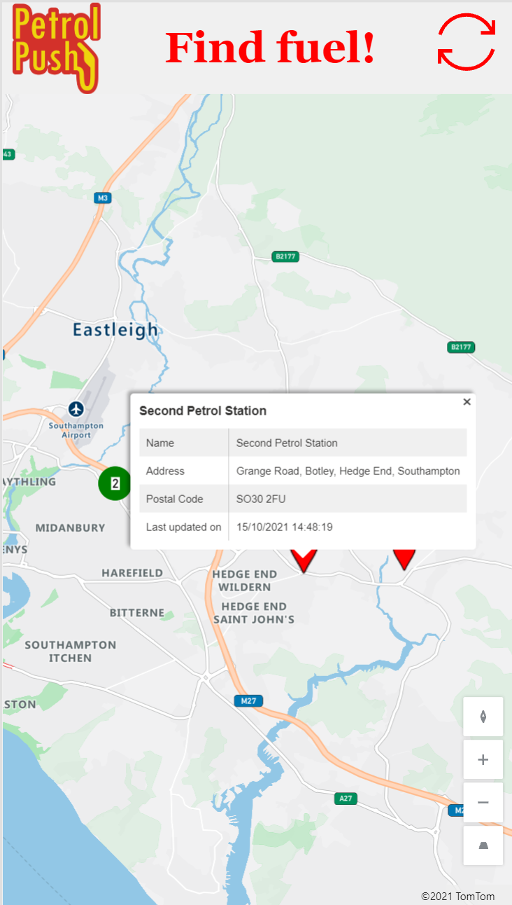
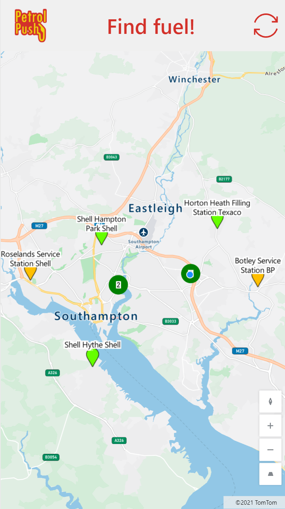
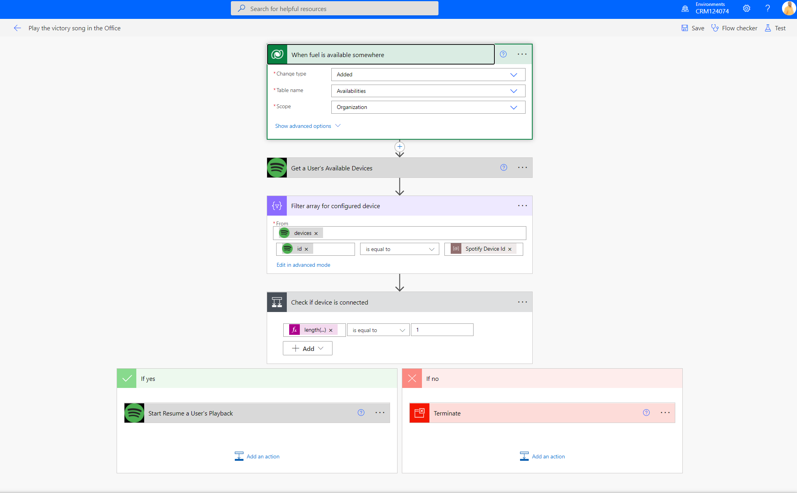

# HackSouthCoastSummit

Team Working on it - Petrol Push

## Purpose of Solution - Usecase

As there are fuel shortages in UK we wanted to have an easy solution to notify each other about the availability of fuel at gas stations.

We use the three event types of our Flic buttons to indicate if

- fuel is found
- gas station ran out of fuel
- issue at gas station (long queue)

We want to show the gas stations as red/amber/green pins on a map in a canvas app

## Canvas App

is working with the built-in maps component, data is stored in Dataverse

## Dataverse Tables

- Petrol Stations
- Availabilities

with following custom columns:

## Spotify API

- App registration
- create custom connector
- Set permission scope to

## Azure Maps

Using Azure Maps API to get location information on nearest gas station to button press events. See also [ARM template](AzureMaps_ARM.json)

## Power Automate flow Spotify

### Environment variables

Device ID (get through API)
Song URI (in the web player)

### workflow

- Trigger: When availability changes to `petrol`
- Action: Get all available Spotify devices
- Action: Filter array for configured device
- Condition: Check if device is connected
  - TRUE: Start resume a user#s playlist
  - FALSE: Terminate

## Power Automate flow BING maps

### workflow

TODO insert screenshot

- Bing Maps API
- Dataverse
- Flic
