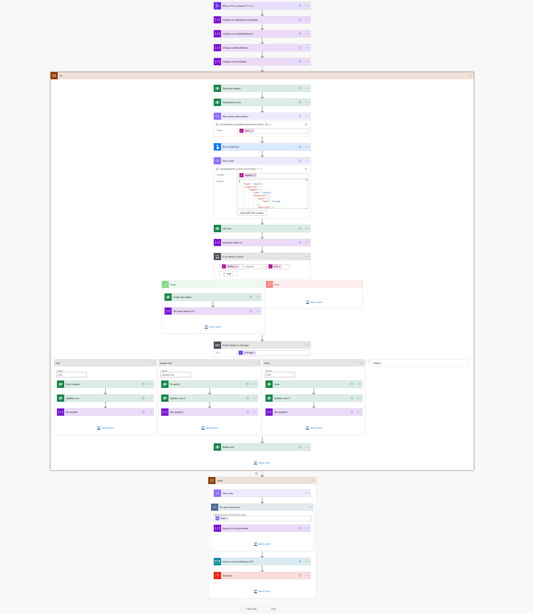

# HackSouthCoastSummit

Team Working on it - Petrol Push

## Purpose of Solution - Usecase

As there are fuel shortages in UK we wanted to have an easy solution to notify each other about the availability of fuel at gas stations.

We use the three event types of our Flic buttons to indicate if

- A gas station has fuel
- A gas station ran out of fuel
- There is an issue at gas station (long queue)

The gas stations are shown as red/amber/green pins on a map in a PowerApps canvas app

## PowerApps Canvas App

* Uses the built-in maps component
* Data is stored in Dataverse

## Dataverse

The following tables are part of the solution:

* Petrol Stations
* Availabilities

With following custom columns:

## Spotify API

* App registration
* Custom connector is included in the solution

## Azure Maps

Uses Azure Maps API server to get location information on nearest gas station to button press events. See also [ARM template](src/AzureMaps_ARM.json)

## Power Automate Flows

### Play Victory Song

#### Environment variables

* Device ID (get through API)
* Petrol Song URI (in the web player)
* Issue Song URI (in the web player)

#### Workflow

* Trigger: When availability changes to `petrol`
* Action: Get all available Spotify devices
* Action: Filter array for configured device
* Condition: Check if device is connected
  * TRUE: Start resume a user#s playlist
  * FALSE: Terminate

### Get Petrol Station from Azure Maps

#### Parameters
* Latitude
* Longitude

#### Workflow

### Petrol Records Flow

## Twilio API

Send an SMS with Twilio in case that availability is `issue`.
