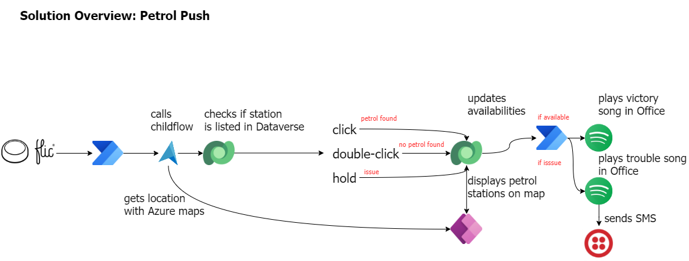
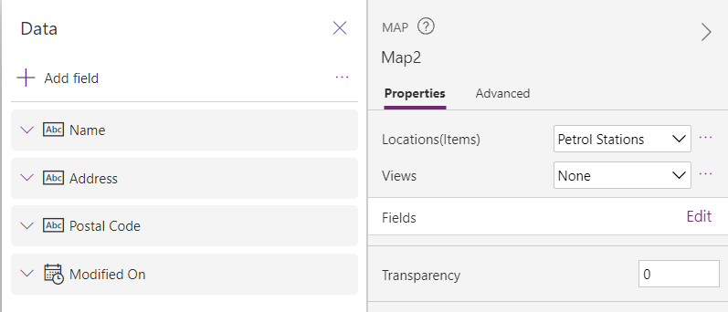

# How 3 makers, 2 devs and a princess came together to save kittens for a hackathon

## The Story (Michael)
Just before Southcoast Summit 2021 got started, the organizers hosted the **Automate Everything - SS2021 Hackathon** where every solution revolves around flic buttons. Wait, you don't know what a flic button is? It's basically a wireless smart button that let's you control devices, apps and services. Push once, twice or hold the button and let each variant trigger a different action. There are multiple usecases in business but also in personal life in which flic buttons make your life easier. Check out the [flic homepage](https://flic.io/) the learn more.

Meet Petrol Push. A modern day organization that has a clear mission: Save kittens. There are hundreds of kittens over all britain that get stuck on trees, get lost within the urban jungle or need help in any other kind of way. Luckily Petrol Push underholds a huge fleet of volunteers to rescue kittens every day. 

**the challenge**
As you may know there is a petrol shortage happening right now and of course you wonder, how can Petrol Push keep up their noble mission? Flic Buttons and the Microsoft Power Platform gave them the ability to come up with a solutions to help all their volunteers in their day to day work. 

**the solution**
Every Petrol Push car got a flic button installed and whenever Petrol Push volunteers pass a gas station, they can indicate with a push of a button, wether the gas station has fuel available or not. This information gets stored on a map so every Petrol Push employer knows where fuel is available and where it's not. This way the volunteers can keep their focus on their mission. They don't need to drive around searching for fuel or worry where to gas up. The community of volunteers takes care of that. 

Petrol Push cares deeply about their volunteers so they don't want to put them in danger in any way. That's why this solution comes with a little extra. Petrol Push workers don't have to check the map over and over again to see whether anything has changed. If one of the volunteers found a gas station where fule is available, the button get's pushed and the fleet will get notified with a song. That way the drivers know when to check the map for updates. 
Within these times it might happen that our drivers get in trouble themselves, run out of gas, have a flat tire or something else. Once again, Petrol Push cares about their volunteers deeply so the flic button provides the opportunity to call other volunteers on the road for help. Once again with a song, so no other driver needs to check their phone. The position gets indicated on the map though, so that help can be arranged quickly. It's only the supervisor that get's an additional textmessage in order to provide further information.

_Note: you will probably know by know, but this usecase exemplifies the ability to combine geographic location with notifications that are not based on text. In this way, we want to draw attention to how versatile Power Platform solutions are and we also want to think about the people who can only use devices in a limited way. Please use this usecase to customize it to your needs. And always remember, only as a community we are strong, so let's be inclusive._

Now, let's dive into details and see how this solution actually works

## The flic and the flow (Tomasz)

## The canvas app (Carmen)

With the data stored in Dataverse, the canvas app can be created to display the available information and inform the people where they can find fuel. The canvas app consists of a header (with the company logo, name and refresh icon) and a map control.

We are using the built-in map control, which allows us to display the gas stations with their appropriate color, automatically center on the user's current location and display additional information about each gas station when selecting the location pin.

To get the location pins on the map, we added the Dataverse table as a source in the `Items` property of the map control. We are currently not doing any filtering, but this could be added if needed. The latitude, longitude, labels and colors is each contained in a specific column within the data source. These are provided as values for the following properties (where the text between quotes is the name of the column in the Dataverse table):

- `ItemsLabels` = `"woi_name"`
- `ItemsLatitudes` = `"woi_latitude"`
- `ItemsLongitudes`= `"woi_longitude"`
- `ItemsColors` = `"woi_color"`

The `woi_colors` columns is defined as a calculated column that is influenced by the value of the `Petrol Status` column in the same table. `Petrol Status` contains the last known status of fuel at the respective station. The colors are defined as hex values with the following mapping:
| Last Known Status | Color | Color name |
|-------------------|-----------|-------------|
| Petrol | "#66FF00" | Light Green |
| No petrol | "#FF0000" | Red |
| Issue | "#FFBF00" | Amber |

The color of the grouped pins is defined by the `PinColor` property of the map control. It is set to `Green`, which is a darker color than the green used for the stations with fuel.

When a pin is selected, the info card is shown. This is defined by setting the `InfoCards` property of the map to `'Microsoft.Map.InfoCards'.OnClick`. The fields that are shown on the info card are defined by editing the `Fields` in the properties pane of the map. Four fields are shown on the info card:

- Name
- Address
- Postal code
- Modified on (to know when the station's status was last updated)

This can be seen on the below screenshot.

## The custom connector to Azure Maps (Lee)

A key part of the solution is populating a list of petrol stations and their status based on presses of the flic button. We initially looked to use the built-in Bing maps Power Automate connector and actions to find the current address when a flic button was used. However, this would return the nearest address, which is not necessarily a petrol station (e.g. it could be a house on the oposite side of the street which is deemed nearer).

To work around this, we created an Azure Maps resource in Azure. Azure Maps can return a list of addresses within a certain radius that fit a particular "POI category" - in this case a petrol station. Using the `subscription-key` (API key) from the Azure Maps resource, we were able to create a custom connector in Power Automate and query for the nearest petrol stations to the longitude and latitude when the flic button was pressed.

## The Spotify connector for the vibes (Yannick)

We like to celebrate victories and help each other in times of need, and what better way than use music for this? We have a sound system in the office connected to Spotify so let's use that to keep everyone updated on things that happen on the road!
A new Power Automate flow will trigger every time a new petrol station status is logged, excluding when no petrol was available. In the case someone found Petrol at a gas status, we get super excited for our colleague and play [Fuel by Metallica](https://open.spotify.com/track/6FUwPb4mGlUDbx42uspXaZ?si=127b17aad3f2448d) in the office to have a small party. When someone gets in trouble, for whatever reason, we play [Trouble by Coldplay](https://open.spotify.com/track/0R8P9KfGJCDULmlEoBagcO?si=97cdd52cd87449c5) (so we know we need to rush to rescue) and a text message is sent to the manager.

Integrating with Spotify isn't too difficult (the API is well-document) but requires the creation of a custom connector with following API actions:
- [Get a User's Available Devices](https://developer.spotify.com/documentation/web-api/reference/#/operations/get-a-users-available-devices): fetch a list of all devices currently connected to the Spotify service
- [Start/Resume a User's Playback](https://developer.spotify.com/documentation/web-api/reference/#/operations/start-a-users-playback): play a song on a specific device

When combining both, we can first fetch all connected devices and then filter them on the device id of our office sound system. If the device is connected, we can play the appropriate song for the occasion with the second API call.  
And lastly, for the text message we'll use Twilio. Luckily they have an existing connector within Power Automate so it's only a matter of registering for a Twilio account, getting a number to send messages from and configuring the action in our flow.

## The princess and the push (Luise)

Straight from the beginning of the hackathon, we took care of documenting our architecture decisions and how we would implement them. We set up a [GitHub repository](https://github.com/LuiseFreese/HacksouthCoastSummit), invited everyone in the team so they could commit their files. We continued to document all major steps so that everyone could use this as a reference to explain our solution, although each member was only in charge of their workload. Getting all information and documenting while building ensured accuracy but also gave an opportunity to think through the app and reflect on decisions.

Documentation includes screenshots of the flows, explains the data model and environment variables. We also published the solution itself in this repository to give community the chance to play with our app.

## What can we learn from this epic quest? (everybody)

- do things the right way instead of trying to do everything but in a messy way
- take care of documentation
- team of diverse backgrounds, experiences and perspectives leads to great outcomes regarding
  - technical solution
  - learning
  - team spirit
- if you build/create something you are a developer
